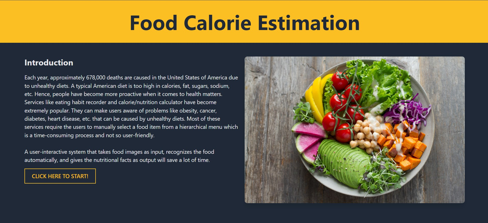
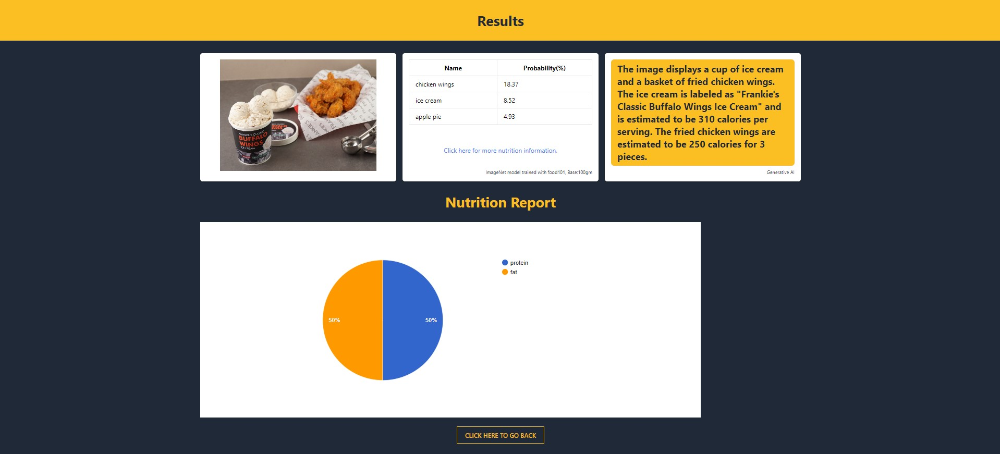
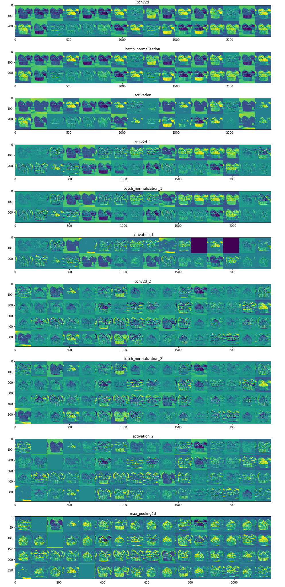

# Food-Calorie-Estimation  with Integrated Generative AI

<!-- TABLE OF CONTENTS -->
## Table of Contents

- [Food-Image-Recognition](#food-image-recognition)
  - [Table of Contents](#table-of-contents)
  - [About the Project](#about-the-project)
    - [Overview](#overview)
    - [Built With](#built-with)
    - [Dataset](#dataset)
  - [Results](#results)
    - [Demo](#demo)
    - [Visualization of different layers.](#visualization-of-different-layers)
  
  - [Contact](#contact)
  - [References](#references)
  
## About the Project

### Overview

* Each year, approximately 6,78,000 deaths are caused in the United States of America due to unhealthy diet. 
* A typical American diet is too high in calories, fat, sugars, sodium, etc. 
* Hence, people have became more proactive when it comes to health matters. 
* Services like eating habit recorder and calorie/nutrition calculator have became extremely popular. 
* They can make users aware of problems like obesity, cancer, diabetes, heart-disease, etc. that can be caused by unhealthy diets.
* Most of these services require the users to manually select a food item from a hierarchical menu which is a time consuming process and not so user friendly.   
* An user-interactive system that takes food images as an input, recognizes the food automatically and gives the nutritional-facts as an output will save a lot of time. 
* This system can be used in various areas such as social network, health-care applications, eating-habit evaluations, etc.
* For food image recognition we will be using transfer learning to retrain the final layer (with 101 additional food-classes) of Inception-v3 model which is already trained by Google on 1000 classes.
* It almost took 10-11 hours to train the model on Google Colab.    

### Built With

* [Python](https://www.python.org/)
* [Jupyter Notebook](https://jupyter.org/)
* [Google Colab](https://colab.research.google.com/)
* [Generative AI](https://pypi.org/project/google-generativeai/)

### Dataset

Food Images Source: [The Food-101 Data Set](https://data.vision.ee.ethz.ch/cvl/datasets_extra/food-101/)
  
  * The data set consists of 101 food categories, with 1,01, 000 images.
  * 250 test images/per class and 750 training images/per class are provided.
  * All the images were rescaled to have a maximum side length of 512 pixels. 

Nutrition Information Source: [Food Data Central API](https://fdc.nal.usda.gov/api-guide.html#bkmk-3)

  * U.S. Department of Agriculture, Agricultural Research Service. FoodData Central, 2019. fdc.nal.usda.gov. 

## Results

### Demo

### Visualization of different layers.

## Contact
 

Nikhil Chakravarthy - [Portfolio](https://nikhilchakravarthy.netlify.app)

## References

* [https://cspinet.org/eating-healthy/why-good-nutrition-important](https://cspinet.org/eating-healthy/why-good-nutrition-important)
* [https://www.tensorflow.org/api_docs/python/tf/keras/applications/InceptionV3](https://www.tensorflow.org/api_docs/python/tf/keras/applications/InceptionV3)

<!-- MARKDOWN LINKS -->
<!-- https://www.markdownguide.org/basic-syntax/#reference-style-links -->
[contributors-shield]: https://img.shields.io/github/contributors/MaharshSuryawala/Food-Image-Recognition?style=flat-square 
[contributors-url]: https://github.com/MaharshSuryawala/Food-Image-Recognition/graphs/contributors
[license-shield]: https://img.shields.io/github/license/MaharshSuryawala/Food-Image-Recognition?style=flat-square?style=flat-square
[license-url]: https://github.com/MaharshSuryawala/Food-Image-Recognition?style=flat-square/blob/master/LICENSE.txt
